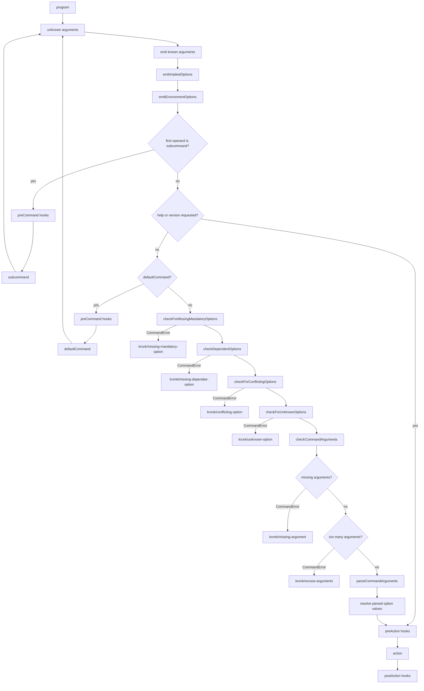

# Parsing and Hook Flow

Parsing starts with the root command, *program*, and an array of unknown arguments.\
Each subsequent command then processes and removes known arguments (i.e. options, subcommands), and passes down
remaining arguments to the next command. The final (running) command calls the action handler.

